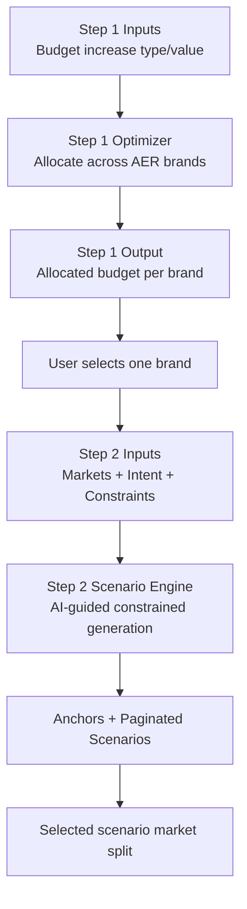
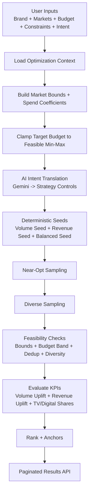
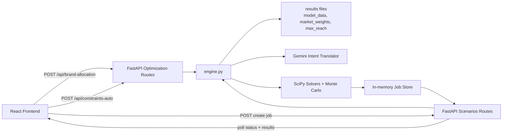

# Marketing Budget Optimizer (Step 1 + Step 2): Detailed English Guide

This document explains the full current pipeline in backend (`marketing-budget-allocation-backend/app/services/engine.py`):

- Step 1: National-to-brand budget allocation
- Step 2: Brand-market scenario generation

It covers objectives, formulas, constraints, AI role, ranking, async APIs, and practical interpretation.

---

## 0) End-to-end pipeline (complete wiring)

---

## 0.1) Step 1: National to Brand allocation (what happens)

Step 1 solves: how to split total AER portfolio budget across AER sub-brands.

### Inputs

- Budget increase type: `percentage` or `absolute`
- Budget increase value
- Optional brand list (default: AER brands from national learnings)
- Halo flags: `include_halo`, `halo_scale`

### Data used

- Model data (brand baseline spend/volume/price signals)
- India-level national learnings sheet:
  - base brand elasticities
  - halo matrix across AER brands

### Core logic

1. Compute baseline budget per brand from latest FY.
2. Compute baseline volume and average price (last 3 points) per brand.
3. Build effective elasticity:
   - base elasticity + optional halo uplift.
4. Compute requested total budget and clamp to feasible total range under per-brand limits.
5. Optimize allocation to maximize estimated revenue.

### Step 1 optimization objective

For each brand `b`:

- `new_volume_b = base_volume_b * (1 + effective_elasticity_b * spend_change_ratio_b)`
- `spend_change_ratio_b = (allocated_b - baseline_b) / baseline_b`
- `new_revenue_b = new_volume_b * avg_price_b`

Objective:

- maximize `sum(new_revenue_b)` across brands

### Step 1 hard constraints

- Sum of brand allocations equals target total (after feasible clamp)
- Per-brand budget movement limit: **-25% to +25%** from baseline
- Frontend now also exposes and validates:
  - `min_allowed_budget`
  - `max_allowed_budget`

### Step 1 outputs used downstream

- `allocated_budget` per brand
- `share` per brand
- revenue/volume uplift estimates per brand
- `feasible_min_total_budget`, `feasible_max_total_budget`

Step 2 receives brand-level allocated budget as its budget basis for selected brand.

---

## 1) What this engine is doing

Step 2 is an **AI-guided constrained scenario generator** for one selected brand and selected markets.

It does three things together:

1. Solves deterministic optimization seeds (volume-opt and revenue-opt).
2. Uses AI intent to guide exploration strategy (not to set final allocations directly).
3. Generates many feasible scenarios with hard constraints and ranks them.

---

## 2) High-level flow map

---

## 3) Current key constants (live behavior)

From backend constants:

- `SCENARIO_TARGET_TOTAL = 1000`
- `SCENARIO_TARGET_DEFAULT = 1000`
- `SCENARIO_TARGET_NEAR_OPT = 100`
- `SCENARIO_DEFAULT_MIN_DISTANCE = 0.04`
- `SCENARIO_NEAR_OPT_MIN_DISTANCE = 0.04`
- `SCENARIO_BUDGET_BAND_LOWER_RATIO = 0.85` (current operating band is 85%-100% of target, further clipped by feasible min)
- `SCENARIO_MAX_ATTEMPTS = 65000`
- `SCENARIO_JOB_TTL_SECONDS = 24 hours`

---

## 4) Inputs and decision variables

For each selected market, optimizer uses two variables:

- `tv_change_pct_var` (relative TV reach/spend movement)
- `digital_change_pct_var` (relative Digital reach/spend movement)

If there are `N` markets, vector dimension is `2N`.

---

## 5) Constraints (hard, never bypassed)

All accepted scenarios must satisfy:

1. Market-level variable bounds derived from:
   - global limits (TV 0.1% to 300%, Digital 0.1% to 400%)
   - max/min reach from `max_reach` data
   - user overrides (reach/spend/CPR)
2. Budget band feasibility (current):
   - lower = `max(feasible_min_budget, 0.85 * target_budget)`
   - upper = `target_budget`
3. Dedup and diversity checks:
   - exact duplicate removal by rounded decision vector key
   - distance threshold (normalized L2) for near-duplicates

Important: AI intent cannot bypass these constraints.

---

## 6) Budget handling logic

### 6.1 Feasible range

Engine computes:

- `feasible_budget_min`
- `feasible_budget_max`

Then requested target is clamped:

- `target_budget = clamp(requested_target_budget, feasible_min, feasible_max)`

### 6.2 Scenario operating band

Scenario generator accepts spends in:

- `[scenario_budget_lower, scenario_budget_upper]`
- where:
  - `scenario_budget_upper = target_budget`
  - `scenario_budget_lower = max(feasible_budget_min, 0.85 * target_budget)`

This avoids forcing all scenarios to one extreme exact-spend point.

---

## 7) AI intent translation (what AI does)

Gemini receives:

- User intent prompt
- Constraint context summary (brand, market count, budget info, selected markets)

Gemini returns only strategy controls:

- `family_mix_weights` over:
  - `volume`
  - `revenue`
  - `balanced`
- `pace_preference`: `steady | fast`
- `coverage_preference`: `few | broad`
- `diversity_preference`: `low | medium | high`

If Gemini fails (429/400/404/schema issues), fallback deterministic strategy is used.

---

## 8) How scenarios are generated

### 8.1 Deterministic seeds

Before Monte Carlo:

- Solve volume objective seed.
- Solve revenue objective seed.
- Create balanced seed = average of the two, clipped to bounds.

### 8.2 Near-opt phase

- Target: up to 100 near-opt scenarios (10% of total, capped).
- Sample around volume/revenue seeds with smaller sigma.

### 8.3 Diverse phase

- Continue sampling broader candidates using AI family weights.
- Sampling family chosen by weighted random draw.

### 8.4 Relaxation phase

If accepted scenarios are still low:

- min-distance is progressively relaxed (50%, 25%, 10%, then 0).
- Additional passes are run to extract feasible unique points.

---

## 9) KPI evaluation and ranking

Each accepted scenario computes:

- `volume_uplift_abs`, `volume_uplift_pct`
- `revenue_uplift_abs`, `revenue_uplift_pct`
- `weighted_tv_share`, `weighted_digital_share`
- market-level splits and deltas

### Balanced score

Balanced score is:

- `0.5 * norm(volume_uplift_pct) + 0.5 * norm(revenue_uplift_pct)`
- norm is min-max normalization over accepted pool

### Anchors returned

- Best Volume
- Best Revenue
- Best Balanced

---

## 10) API map and async lifecycle

Endpoints:

- `POST /api/brand-allocation` -> Step 1 national-to-brand allocation
- `POST /api/constraints-auto` -> Step 2 constraint preview
- `POST /api/scenarios/jobs` -> create async job
- `GET /api/scenarios/jobs/{job_id}` -> status poll
- `GET /api/scenarios/jobs/{job_id}/results` -> paginated results

Job states:

- `queued`
- `running`
- `completed`
- `failed`
- `expired`

Note: Jobs are currently in-memory. If backend restarts/reloads, old job IDs return 404.

---

## 11) Why scenario count can be low

Low count happens when feasible space is genuinely small, typically because:

1. Target budget is at/near feasible upper boundary.
2. Many market bounds are tight at same time.
3. Overrides shrink feasible movement.
4. Decision vectors collapse to very similar points after projection.

This is not usually a rounding problem.

---

## 12) Tuning levers (if you want more scenarios)

Primary levers:

1. Keep target budget away from hard edge.
2. Relax tight market max/min bounds where business allows.
3. Increase selected markets (more degrees of freedom).
4. Lower diversity threshold defaults if desired (careful: quality tradeoff).
5. Increase runtime/attempt limits for heavy feasible spaces.

---

## 13) Quick interpretation guide for business users

When reading output:

1. `scenario_count` tells how many unique feasible options were truly found.
2. `generation_notes` explains if feasibility clamps/relaxations were needed.
3. Compare anchors first (volume vs revenue vs balanced).
4. Then inspect market-level split changes for chosen scenario.

---

## 14) Current architecture map

---

## 15) One-line summary

This is a **hard-constrained optimizer + AI-guided sampler**. AI steers exploration, but final feasibility is fully controlled by mathematical constraints and budget/market bounds.
